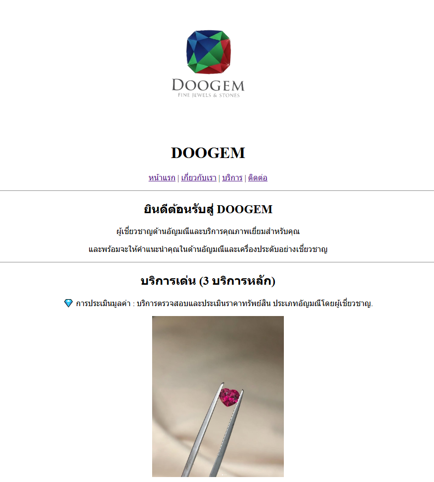
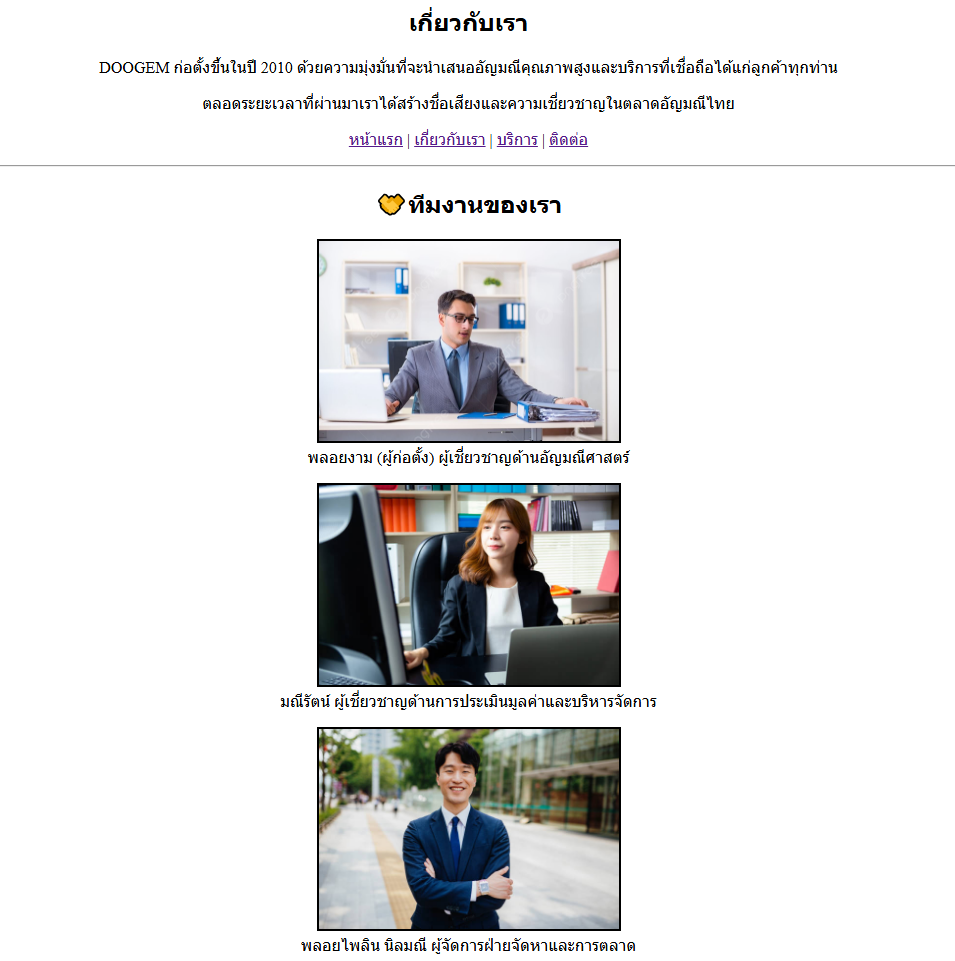
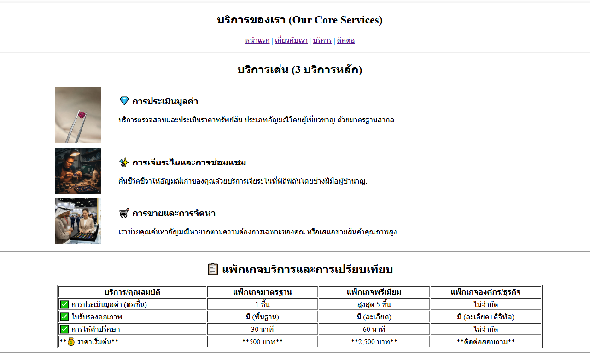
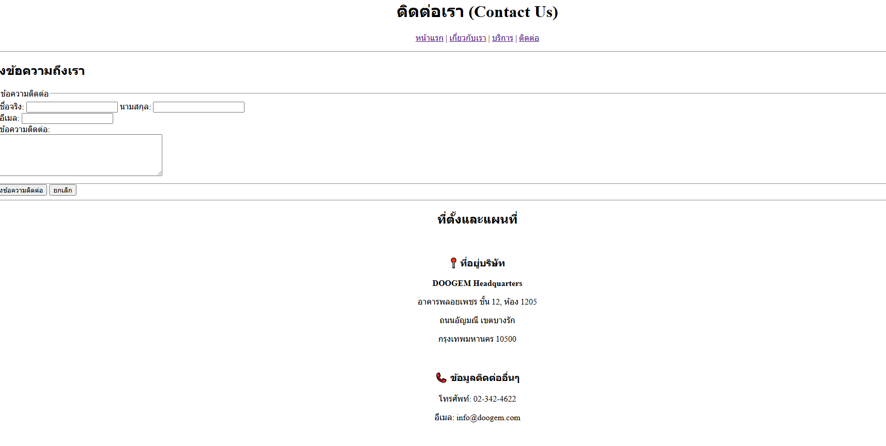

# Create DOOGEM Website

## Description

- โปรเจกต์นี้คือการจำลองโครงสร้างพื้นฐานของเว็บไซต์ DOOGEM โดยใช้ HTML (HyperText Markup Language) เป็นหลักในการจัดวางเนื้อหาและกำหนดโครงสร้างของหน้าเว็บ

## File Structure

- **index.html** - หน้าหลักของเว็บ DOOGEM
- **about.html** - บอกข้อมูลเกี่ยวกับเว็บ DOOGEM
- **services.html** - บริการต่างๆ ของ DOOGEM เช่น การประเมินคุณค่าอัญมณี การขายและจัดหา
- **contact.html** - ช่องทางการติดต่อ ที่ตั้งของ DOOGEM
- **images/** - โฟลเดอร์เก็บไฟล์รูปภาพต่างๆ 
- **README.md** - เอกสารอธิบายข้อมูลต่างๆ

## Web Screenshots

1. [คลิกเพื่อดูหน้าหลัก /index.html](/index.html)

2. [คลิกเพื่อดูเกี่ยวกับ /about.html](/about.html)

3. [คลิกเพื่อดูบริการ /services.html](/services.html)

4. [คลิกเพื่อดูติดต่อ /contact.html](/contact.html)

