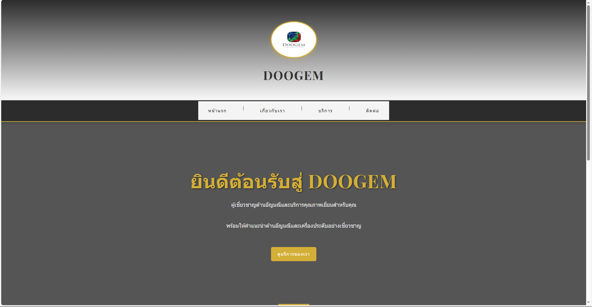
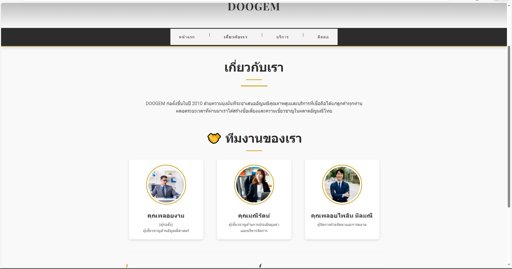
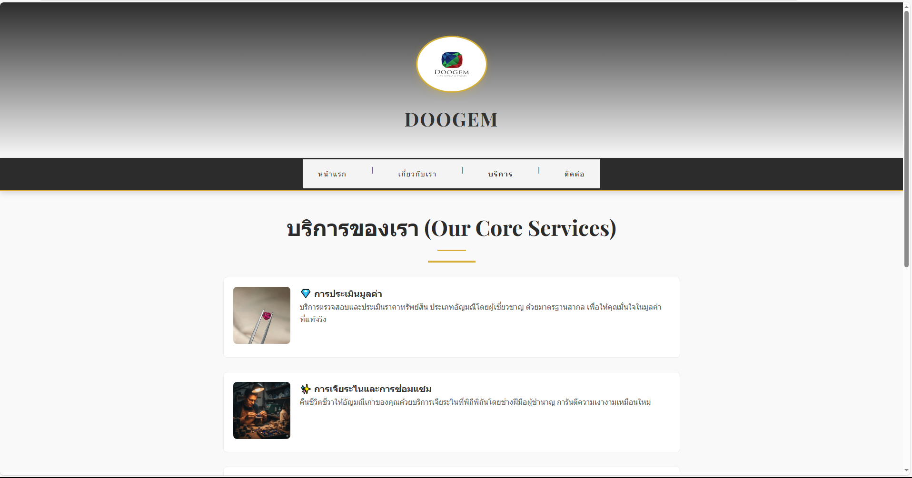
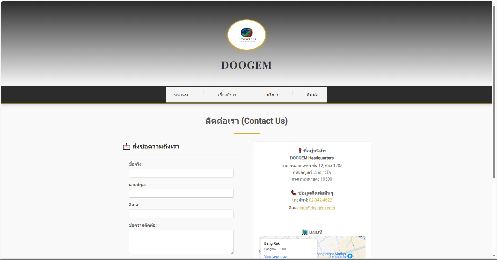

# DOOGEM Website 💎💍

## Project Description

- นี่คือการจำลองหน้าเว็บไซต์ของ **DOOGEM** ผู้เชี่ยวชาญด้านอัญมณีและเครื่องประดับ
- สร้างขึ้นเพื่อฝึกทักษะการพัฒนาเว็บไซต์ด้วย **HTML5** และ **CSS3**
- จำลองโครงสร้างเว็บไซต์ธุรกิจประกอบด้วย 4 หน้าหลัก: หน้าแรก, เกี่ยวกับเรา, บริการ, และติดต่อเรา
- เนื้อหาครอบคลุมข้อมูลบริษัทจำลอง บริการต่างๆ (เช่น การประเมินราคา, การเจียระไน) และแพ็กเกจราคา
- มีการนำ **CSS Fundamentals** มาใช้ตกแต่งเพื่อความสวยงามและรองรับการแสดงผลที่ทันสมัย

## Key Features (คุณสมบัติเด่น)

- **Responsive Layout:** จัดหน้าเว็บให้สวยงามด้วย Flexbox และ Grid
- **Hero Section:** ส่วน Banner ต้อนรับขนาดใหญ่พร้อมคำโปรยที่ดึงดูด
- **Services Grid:** การแสดงผลรายการบริการแบบการ์ด (Card Layout)
- **Pricing Table:** ตารางเปรียบเทียบแพ็กเกจราคาที่อ่านง่ายและมีการแบ่งสีชัดเจน
- **Contact Form:** แบบฟอร์มติดต่อสอบถามที่จัดวางอย่างเป็นระเบียบ
- **Google Maps Embed:** การฝังแผนที่จำลองตำแหน่งที่ตั้งร้าน

## File Structure

- **index.html** - หน้าแรกของเว็บไซต์ พร้อม Hero Banner และแนะนำบริการเด่น 3 รายการ
- **about.html** - หน้าเกี่ยวกับเรา แสดงประวัติความเป็นมา วิสัยทัศน์ และทีมงาน
- **services.html** - หน้าบริการ แสดงรายละเอียดแต่ละบริการและตารางเปรียบเทียบราคา
- **contact.html** - หน้าติดต่อเรา มีแบบฟอร์มส่งข้อความ ข้อมูลที่อยู่ และแผนที่
- **styles.css** - ไฟล์ CSS ควบคุมการตกแต่งธีมสีทอง-ขาว และการจัดวางทั้งหมด
- **images/** - โฟลเดอร์เก็บรูปภาพประกอบ
  - `LOGO.png`, `Ruby.png`, `gem.jpg`, `seller.jpg`
  - `Employee1.jpg`, `employee2.jpg`, `employee3.jpg`
- **screenshots/** - โฟลเดอร์เก็บภาพตัวอย่างหน้าเว็บไซต์
- **README.md** - เอกสารสำหรับอธิบายรายละเอียดของโปรเจกต์นี้

## All screenshots and links to each page

### 1. หน้าแรก (Home)

[คลิกเพื่อดูหน้าแรก](./index.html)

### 2. หน้าเกี่ยวกับเรา (About Us)

[คลิกเพื่อดูหน้าเกี่ยวกับ](./about.html)

### 3. หน้าบริการ (Services)

[คลิกเพื่อดูหน้าบริการ](./services.html)

### 4. หน้าติดต่อเรา (Contact)

[คลิกเพื่อดูหน้าติดต่อ](./contact.html)

